<p align="center">
  
</p>

# AVTTY

*A Very Tiny Text Yard*

AVTTY is a small, friendly text editor for the terminal, written in C. It starts fast, follows your terminal's colors, and has everything you reach for when editing code or config files, without a manual to read first.

It is part of the [texivi software suite](tss.md)

<p align="center">
  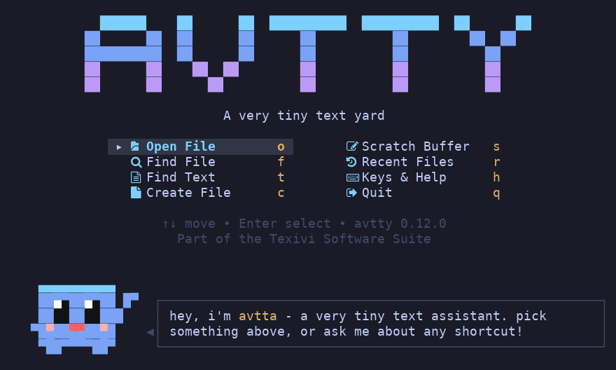
</p>

## Meet avtta

AVTTY comes with a tiny helper, **avtta** (*a very tiny text assistant*). It stays out of your way and only pops up when it matters: **saving**, **quitting with unsaved changes**, or when **something goes wrong**.

<p align="center">
  
</p>

avtta has 15 poses and uses them for real: waving hello, cheering when you save, worried when you have unsaved changes, confused when it can't find something, and more.

<p align="center">
  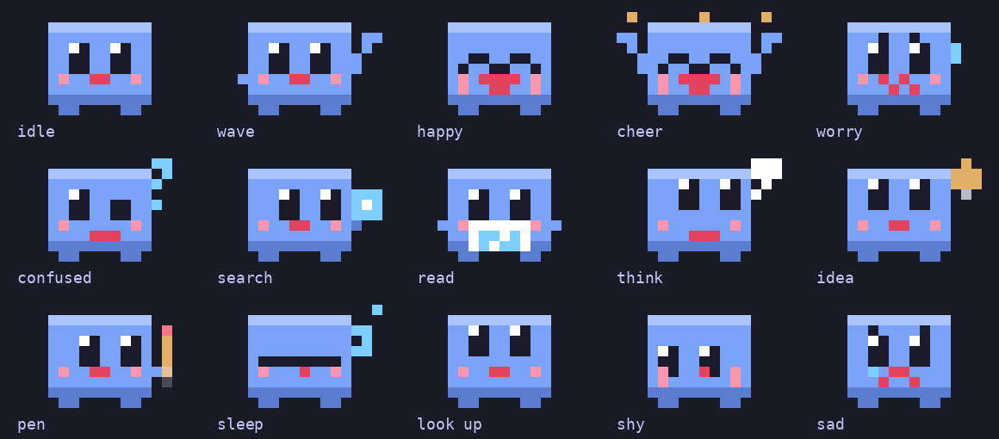
</p>

## Make a file and save it

Pick **Create File** on the start screen, or press `c`, and type a name.

<p align="center">
  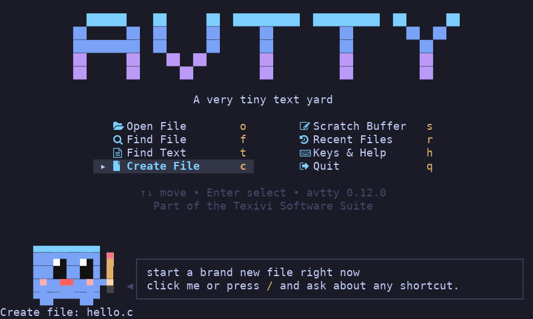
  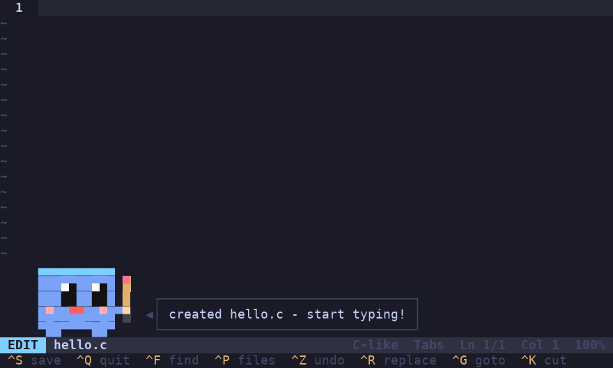
</p>

Start typing. Code gets syntax colors, auto-pairs and smart indent. Press `Ctrl-S` to save.

<p align="center">
  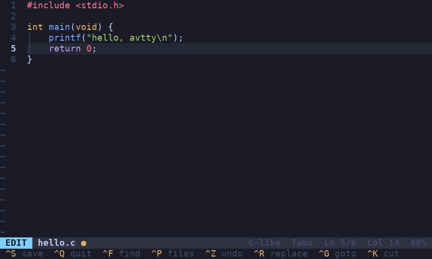
  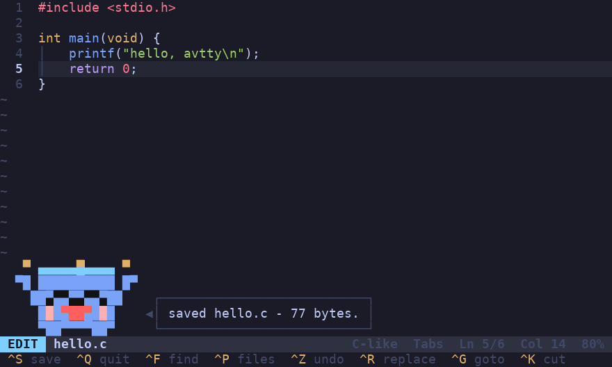
</p>

## Quit without saving

Changed something and hit `Ctrl-Q`? avtta stops you before you lose it: save and quit, discard and quit, or keep editing.

<p align="center">
  
  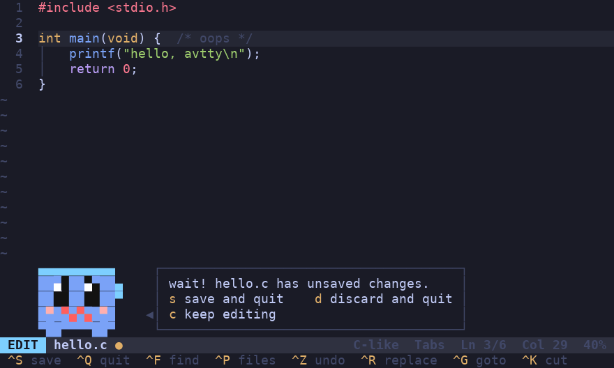
</p>

## Find things

`Ctrl-F` finds text in the file you're editing, `Ctrl-P` finds a file by name, and `Alt-F` finds text in every file in the folder.

<p align="center">
  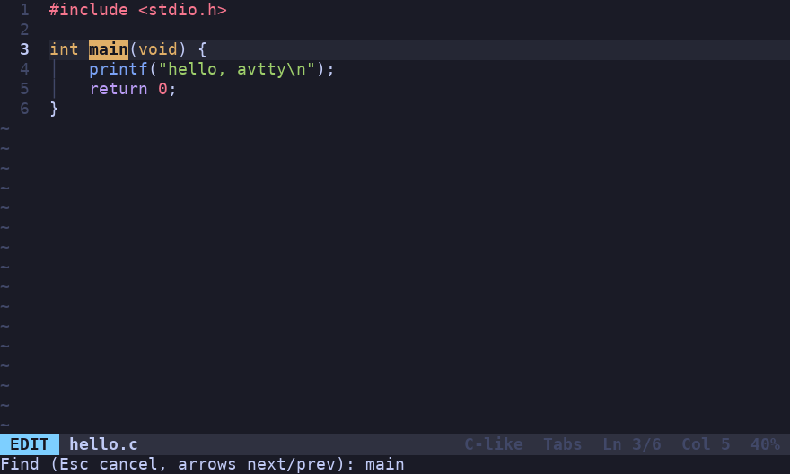
  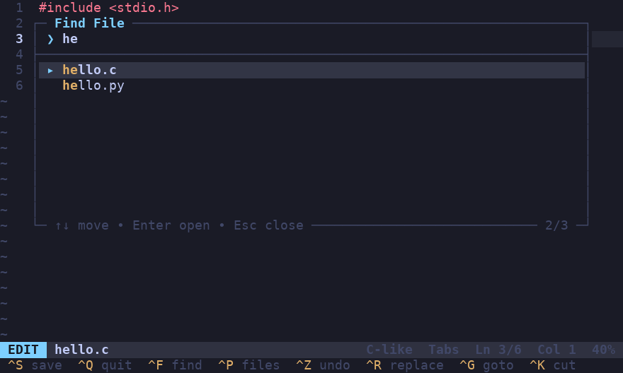
</p>
<p align="center">
  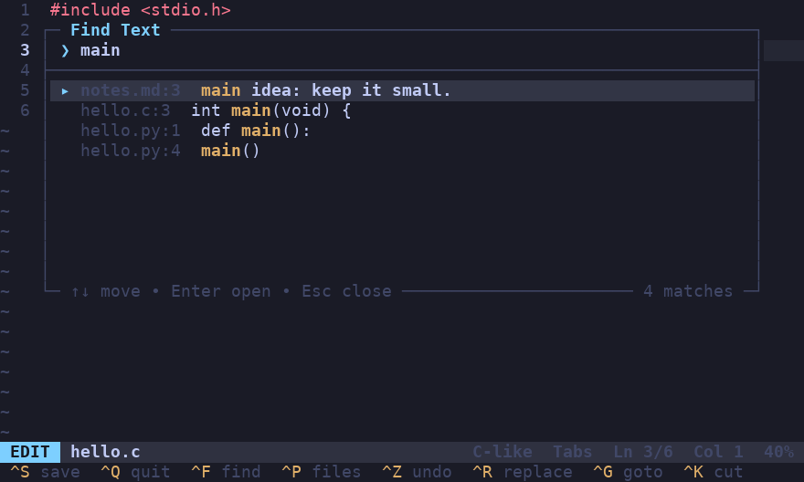
</p>

## Ask avtta

Forgot a shortcut? Press `F1` in the editor (or `/` on the start screen) and ask in plain words: *"undo"*, *"jump to a line"*, *"save"*. avtta finds the shortcut for you.

<p align="center">
  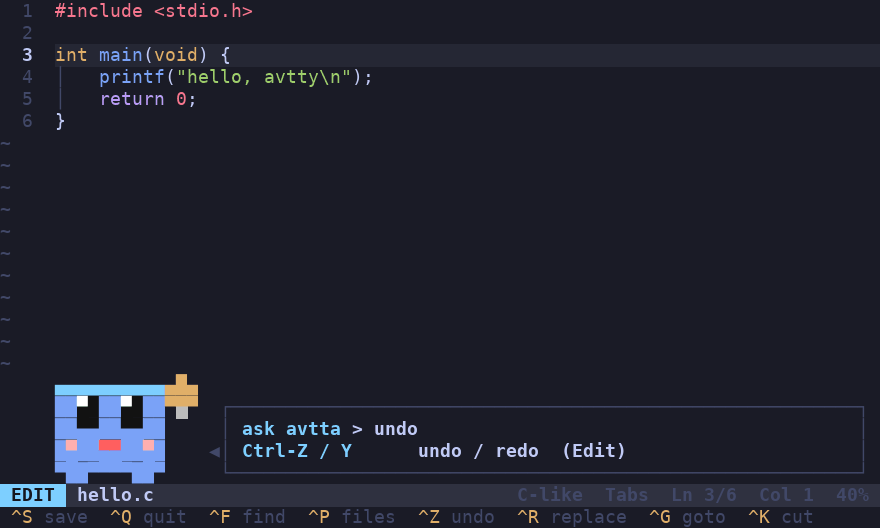
  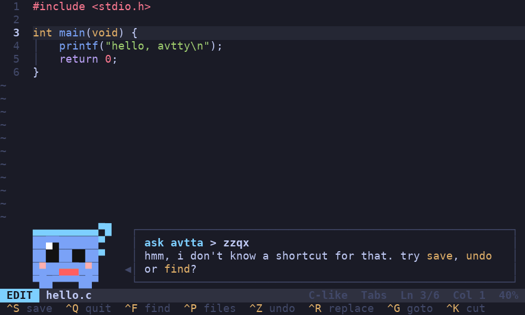
</p>

Every shortcut also fits on one screen. Press `h` on the start screen.

<p align="center">
  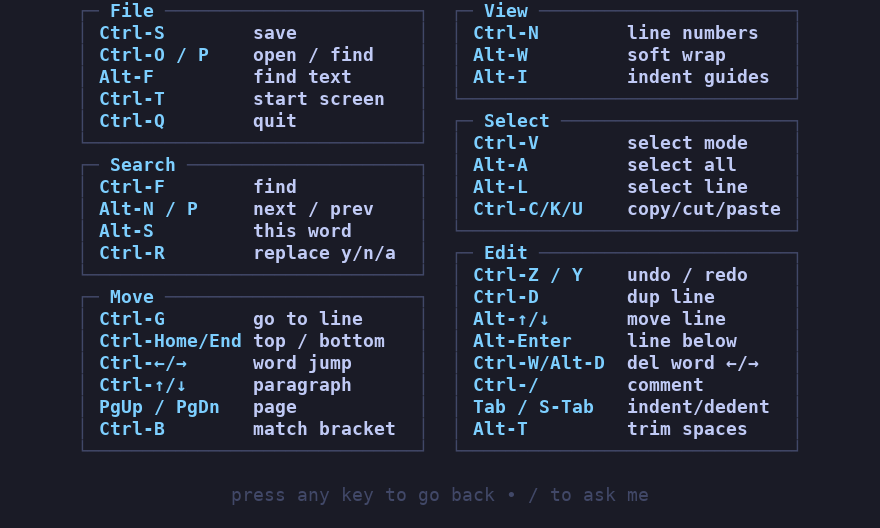
</p>

## Your text is safe

- Saves are atomic, so a crash mid-save can't leave you with half a file
- Symlinks, CRLF line endings and missing final newlines are all preserved
- If your terminal closes unexpectedly, your work is rescued to `<file>.save`

## Small on purpose

AVTTY is about ***2,800 lines*** of C (roughly **110 KB** of source) and builds to a binary of about **100 KB**. It's small enough to read in an afternoon, and it runs anywhere you have a terminal.

It edits one file at a time and has no plugins, splits or macros. If you need those, AVTTY probably isn't the right tool, and that's okay.

## Installation

```sh
git clone https://github.com/texivi/avtty
cd avtty
chmod +x install.sh
./install.sh
```

Or build it yourself:

```sh
cc -O2 -o avtty avtty.c
```

## Usage

For help use

```sh
avtty -h
```

```
avtty [+line] [file]     open a file (new buffer if it doesn't exist)
avtty -o file            open an existing file
avtty -c file            create a new file
avtty -d file...         delete files (never directories, never system paths)
cmd | avtty              edit piped text, save it with Ctrl-S
```

Inside the editor, `F1` (or `Alt-H`) shows every key.

## License

GPL-3.0
